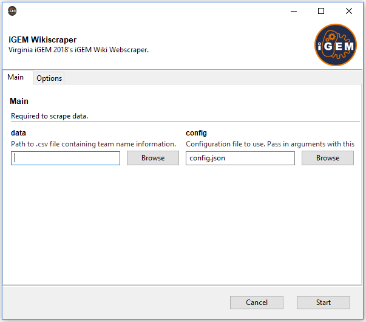
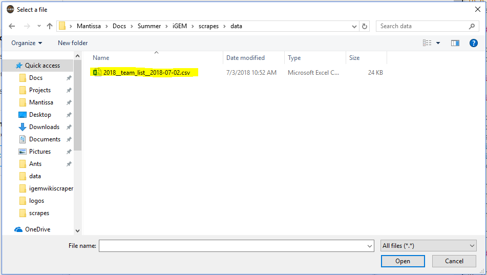

# igem-wikiscraper

A quick-and-dirty Python CLI tool for scraping iGEM wikis. Can be used to pull out any relevant HTML-based information. Note that this tool will not function on, for example, lab manuals involving PDFs, pages that dynamically load in content on user interaction or page scroll, or pages that redirect to other websites (not that this is allowed by iGEM).

As-configured, the tool is designed to only look for paragraphs on teams' homepages or Descriptions pages that look like project descriptions (fairly long, multiple sentences, etc. etc.). This is because our team used the tool to pull all teams' descriptions from all 2018 wikis to try and find collaboration partners. If you would like to modify the functionality, this can be done through the config.json file.

## Use

This tool currently only functions with Python3. Python2 compatibility is on the backburner. **Any instructions assume you have Python3 installed and on PATH. Instructions also assume `pip` refers to Python 3 pip and not Python 2 pip.**

General instructions are below. See [gui](#gui) for an easy-to-use graphical interface and [terminal](#terminal) if you need more flexibility and aren't afraid of a console.

1. Install via `pip`
2. Create a new folder to hold all your information and scrapes. Add `data` and `output` subdirectories
3. Copy `config.json` from [here](https://raw.githubusercontent.com/Virginia-iGEM/igem-wikiscraper/master/igemwikiscraper/config.json) into this new folder
4. Retrieve data from http://igem.org/Team_List.
5. Modify `config.json` as you see fit. Descriptions of config options are available [below](#configuration).
6. Use either `wikiscraper` or `wikiscraper-gui`. See below.

### GUI

For easy installation and use, right click on the appropriate link below and click `Save link as`:
- [Windows](https://raw.githubusercontent.com/Virginia-iGEM/igem-wikiscraper/master/init.bat) 
- [Mac/UNIX](https://raw.githubusercontent.com/Virginia-iGEM/igem-wikiscraper/master/init.sh)

Move the downloaded file (init.bat or init.sh) to the folder where you would like to store your data (such as your Documents). Double click on the file; this will install wikiscraper and create a folder named `igem-scrapes` containing 2018 iGEM data and an example filestructure and config.json file.

Enter the `igem-scrapes` folder and double click on the file named `wikiscraper-gui`. If all went well, this should launch a small window that looks like this:



Click `browse` on the `data`option and navigate to where you've initialized the `igem-scrapes` folder and find the file named `2018__team_list__2018-07-02.csv`. Select this file.



Once this is done, hit the `start button, and the scrape will begin. Data will be placed in a file named `descriptions.csv` in the data folder.

The default configuration file will only scrape the first 10 teams on this list; you may have also noticed that this list is only for 2018. If you need data for a later year, or a previous year, or all years, this data can be found on the [igem website](http://igem.org/Team_List).

We strongly reccommend configuring the tool by editing `config.json` instead of changing values in the options tab, as your changes to the options tab will not be saved. This can be done with Notepad on Windows or TextEdit on Mac. [Notepad++](https://notepad-plus-plus.org/) works on all OSes if you would like syntax highlighting and error validation for this file.

In order to understand config.json, see the [Configuration](#configuration) section.

### Terminal

These commands should work for Ubuntu. For Windows, substitute `pip` for `pip3`. For Mac or other UNIXes, you're on your own. Install scripts are also available:
- [Windows](https://raw.githubusercontent.com/Virginia-iGEM/igem-wikiscraper/master/init.bat) 
- [Mac/UNIX](https://raw.githubusercontent.com/Virginia-iGEM/igem-wikiscraper/master/init.sh)

```bash
pip3 install igemwikiscraper
mkdir igem-scrapes
cd igem-scrapes
curl https://github.com/Virginia-iGEM/igem-wikiscraper/blob/master/igemwikiscraper/config.json -o config.json
mkdir {data,output}
cd data
wget https://raw.githubusercontent.com/Virginia-iGEM/igem-wikiscraper/master/data/2018__team_list__2018-07-02.csv -o 2018__team_list__2018-07-02.csv
cd ..
wikiscraper data/2018__team_list__2018-07-02.csv
```

Output file can be found under `output/` or as configured.

Edit `config.json` with your preferred text editor. `nano` should work fine if you're unfamiliar with a termianl text editor. [Configuration](#configuration) elaborates on what each option changes.

## Brief Description of Tool Function

The tool retrieves raw HTML from URLs generated from a list of team names and years. This raw HTML is then passed through BeautifulSoup, a combination HTML Parser and HTML Selector built specifically for webscraping. 

Specific HTML tags are removed in preprocessing (such as script and style tags, which we don't need), then a set of tags is selected with an emulated JQuery selector (with the `htmlselector` option). This set of tags is then "strained" by their content, removing entries that are too short, do not contain sentences, and which contain any JavaScript or CSS motifs.

All of the children of selected tags are then unwrapped, discarding their attributes and keeping only their content in (what I believe is) a pre-ordered tree traversal. 

This process occurs for each page specified by `subpages`, leaving us with a list of lists of strings for each team. This 2d list is flattened to 1d by joining the sublists with newlines, before being appended to team information and written out as one row in a .csv file specified by `outputfile`. This is repeated for each team in the teamlist, building up a list of team information paired with useful scraped data.

## Configuration

Note: Some of these options can be set when using the CLI. Enter `wikiscraper -h` for a list of options which can be set through the CLI. This is convenient for options like `-vv` which you may not want to see on every scrape attempt.

- data: Options for what kind of data we take in and look for
  - subpages: Which pages on the wiki to look at. `""` denotes the index. Note that each page is lead with a forward slash; every page must be lead with a forward slash. Examples: `/Team`, `/Safety`
  - filedelimiter: What kind of csv delimiter is the team name list using? The iGEM Team List page seems to generate CSV's with comma delimiters.
  - start: Which team in the list to start with. Set to negative to remove limit.
  - end: Which team in the list to end with. Set to negative to remove limit.
- scraper: Options for how the scraper filters and interprets data
  - htmlselector: JQuery-style selector for html elements. `#content` seems to include all hand-written team info without including any extra junk. Upon inspecting many iGEM wikis, we found all content _should_ be wrapped in `#mw-content-text`, but because there are _so many_ (about 10% of) iGEM wikis with broken HTML, mostly in the form of unpaired HTML tags, we have to be a bit generous with our selectors.
  - gracetime: Number of seconds to wait between HTML GET requests. Strongly reccommend this to be kept at 1 or above; any lower is considered impolite by web scraping standards, may break the iGEM Wiki, and may be considered a crime (a Denial of Service Attack, albeit a poor one).
  - stripwhitespace: Removes leading and trailing whitespace. Cleans up output a little.
  - collapsenewlines: Removes strings of newlines in retrieved strings
  - excisescripts: Removes any script tags when preprocessing HTML
  - excisestyles: Removes any style tags when preprocessing HTML
  - use: Enables/disables filters listed below.
  - space_count: Filters strings by the number of spaces they contain. If a string has less than this number of spaces, it will be excluded.
  - period_count: Filters string by number of periods contained. If a string has less than this number of periods, it will be excluded.
  - negative_regex: Regex with double-escaped backslashes. If a string matches this regex, it will be excluded.
- output: Options for the output file
  - outputfile: Path to the file we output our results to.
  - filedelimiter: Delimits columns in the output .csv file. Default is a vertical pipe, `|`, useful for plain HTML content.
  - filequotechar: Used to encapsulate escaped strings in .csv files. Doublequotes `"` are fairly standard.
  - verbose: Set to `0` to print progress reports only. Set to `1` to print useful information above each wiki page scraped. Set to `2` to print all content scraped.

## Todo

- Expand collapsenewlines option to also collapse strings of newlines and tabs into just one newline
- Make it so that options under `scraper.use` actually enable/disable the filter
- Replace `excisescripts` and `excisestyles` flags with an HTML selector that excises arbitrary HTML elements
- Either enable output to multiple files or ensure multiple inputs lead to a sane single output
